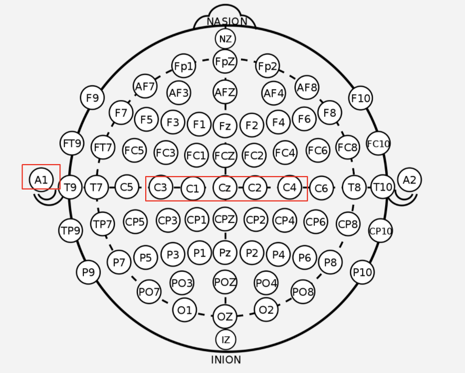

# GUI
Application package for using MiMap

## File Descriptions
- CSVWriter.py: The code used to interface with writing out to a CSV file. 
- DataProcessingHelper.py: Various filtering, epoching, and feature extraction helper methods
- EEGRecorder.py: Recording tool that uses the CSVWriter to record a session of EEG data to CSV. 
- EEGSampler.py: Real-time sampler for live EEG data to be filtered and put through a model for prediction. Manages all the buffers for easy extraction of current data. 
- GUI.py: tkinter frames and main
- KeyPress.py: Logic for actuating keypress
- PowerBinModel.py: Our model for differentiating left vs right motor imagery trials

## Usage
`python3 GUI.py`
- make sure to change LIVE_DATA in GUI.py to false if not recording live EEG
- make sure to have `/data/` and `PowerBinModel.pkl` created in this folder (should be available through cloning of this repo)

## Pin and Electrode Setup (OpenBCI Cyton)
| Pin  | 10/20 Location | Function  |
|:-----|:---------|:----------|
| Bias | Cz | Ground |
| N8P | C3 | Left-most channel |
| N7P | C1 | Left-center channel |
| N6P | C2 | Right-center channel  |
| N5P | C4 | Right-most channel |
| SRB | A1 | Reference Earclip |

 

