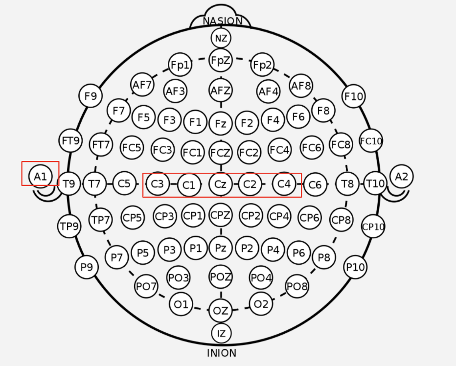

# MiMap: Motor Imagery Controlled Map
MiMap allows patients with paralysis to explore the vast world provided through Google Street View under their own volition. 
  
The system is calibrated to the user through a calibration and neurofeedback phase where the user learns how to produce motor imagery signals by imagining moving their left or right hand. The brain signals are collected through electroencephalography (EEG), used to train a machine learning model, which is then used to predict if the user is thinking to turn left or right or go forward in Google Street View. 
Project Video: https://youtu.be/TgKobB9tW7M

## Github Directories
- [`/GUI`](https://github.com/NeuroTech-UCSD/Motor-Imagery-App-Project/tree/master/GUI) - Files pertaining to actual live data collection. 
  - [`/GUI/data`](https://github.com/NeuroTech-UCSD/Motor-Imagery-App-Project/tree/master/GUI/data) Location where data will be recorded. In this repo, some data to triain a model are provided. 
  - [`/GUI/audio`](https://github.com/NeuroTech-UCSD/Motor-Imagery-App-Project/tree/master/GUI/audio) Beep sounds used for audio signal of the calibration. 
  - [`/GUI/README.md`](https://github.com/NeuroTech-UCSD/Motor-Imagery-App-Project/blob/master/GUI/README.md) More details on how to set up the headset file descriptions. 
- [`/ML`](https://github.com/NeuroTech-UCSD/Motor-Imagery-App-Project/tree/master/ML) - Files pertaining to testing of different models on the data. 

## Usage 
- In [`/GUI`](https://github.com/NeuroTech-UCSD/Motor-Imagery-App-Project/tree/master/GUI), `python3 GUI.py` will run the app. 
  - Please make sure dependencies are satisfied
  - If running the app without a live Cyton headset connected, please ensure that the LIVE_DATA flag in `GUI.py` is set to False. 
- In [`/ML`](https://github.com/NeuroTech-UCSD/Motor-Imagery-App-Project/tree/master/ML), load the folder in Jupyter Notebook and ensure that all paths for data are satisfied (may need to copy from [`/GUI/data`](https://github.com/NeuroTech-UCSD/Motor-Imagery-App-Project/tree/master/GUI/data)) 

## App Flow
The app consists of 3 main phases: Calibration, NeuroFeedback, and App Usage. A view of the live data can be seen in the Stats Monitor page at any time during NeuroFeedback or App Usage. 

## Electrodes used
This project uses electrodes at the motor cortex and a left ear clip for reference.

 The headset had to be put together with a bit of creativity due to the remote collaboration of the project. The way we were able to have one person be able to use the headset was by using dry electrodes attached to a velcro strap held in place by hair bands, as shown below. 

## Calibration Timing
The Calibration procedure is set up like this, so the recorded data will have this structure as well. Typically 10-15 trials for each class (left or right) need to be recorded. The selection of left or right is random at each timepoint to reduce prediction effects. A variable random pause time was also implemented to reduce anticipation effects.

## NeuroFeedback Timing
The NeuroFeedback procedure allows the user to test the model out and learn what might work best to produce the most accurate left vs right motor imagery commands. Similar to the calibration period, there is a prompt triangle that would appear, but then the user would need to try to get the slider to move towards the arrow. This goes on for 6 trials. 

## Data Viewer
A live view of the incoming EEG data and predictions for left vs right motor imagery. 

## Google Street View Usage
App usage maps arrow key outputs to motor imagery prediction values, allowing you to control a Street View application. 

## Partners
* [NeuroTechX](http://neurotechx.org/)
* [OpenBCI](https://openbci.com/)
* [UCSD Electrical and Computer Engineering](http://www.ece.ucsd.edu/)

A special thank you to [Dr. Vikash Gilja](https://profiles.ucsd.edu/vikash.gilja), our faculty advisor, and to [de Sa Lab](https://cogsci.ucsd.edu/~desa/bcigroup/) for lending equipment.

## The Team
We are a dedicated group of undergraduate students from UC San Diego and our mission is to provide opportunities for students to engage in the interdisciplinary field of neurotechnology. 

For more information, please see our [facebook page](https://www.facebook.com/ntxucsd) or [our website](http://neurotechx.ucsd.edu/).
